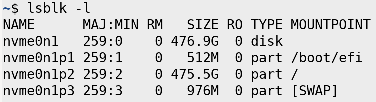
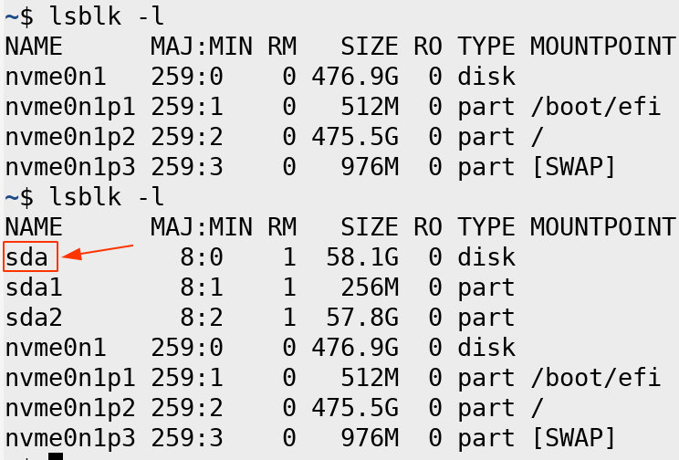

<center><h3><b>Installation of lightweight LinuxCNC HAL in Raspberry Pi 4 + EtherCAT</b><h3/></center>

# 💾 Preparing the MicroSD image:  
  
### Download the pre-compiled image from LinuxCNC project website:
http://www.linuxcnc.org/iso/linuxcnc-2.8.1-pi4.zip

### Connect the microSD card in the computer and see the device name with:
```lsblk -l```



Now attach the microSD card in the computer:



You should see sometihng like /dev/sda

### Uncompress the zip file and write the image into the microSD card:
```sudo dd if=2021-01-20-linuxcnc-pi4.img of=/dev/[your device]```


# 🙌🏿 In case you want to do all the instalation headless (Wifi + SSH). Do the following steps in the microSD boot partition:

### 📶 Enable SSH server in our Raspberry Pi.
```
touch ssh
```

### 📡 Configure the Wifi access:
Creating a wpa_supplicant.conf file.
```bash
touch wpa_supplicant.conf
```
Adding configuration to our file (Copy paste it, and change the Wifi SSID and PASSWORD) :
```bash
ctrl_interface=DIR=/var/run/wpa_supplicant GROUP=netdev
update_config=1
country=FI

network={
ssid="SSID"
psk="PASSWORD"
}
```
* Change SSID (your wifi name) and PASSWORD (wifi password) inside the double quotation marks 

  
# 📥 Start HAL-Core installation:  
  
### Once we connect that to the power and we have internet access:
First we update repositories, them we upgrade the softwares and after that we reboot the system:
```bash
sudo apt update -y
```

If you get this, press 'y' and them the enter key:
```bash
E: Repository 'http://raspbian.raspberrypi.org/raspbian buster InRelease' changed its 'Suite' value from 'stable' to 'oldstable'
N: This must be accepted explicitly before updates for this repository can be applied. See apt-secure(8) manpage for details.
Do you want to accept these changes and continue updating from this repository? [y/N] y
```
then continue:
```bash
sudo apt upgrade -y
sudo reboot
```
If we get some prompt asking, just press `y` and enter key.

### Installing the realtime kernel header:
```bash
sudo apt install linux-headers-4.19.71-rt24-v7l -y
```

### Installing development tools needed to install Etherlabmaster:
```bash
sudo apt install mercurial build-essential automake tree dkms bison flex -y
```

### Installing Etherlabmaster:
```bash
git clone https://github.com/icshwi/etherlabmaster
cd etherlabmaster
make init
echo "ENABLE_CYCLES = NO" > configure/CONFIG_OPTIONS.local
make build
make install
echo "ETHERCAT_MASTER0=eth0" > ethercatmaster.local
make dkms_add
make dkms_build
make dkms_install
make setup
```

### Because the files and libraries are in /opt/etherlab/ we linked it to /usr/lib/ and reboot.
```bash
sudo ln -s /opt/etherlab/lib/lib* /usr/lib/
sudo reboot
```

### At this point we have the EtherCAT master working and running everytime the system starts.
Have a try with the following command:
```bash
ethercat master
```

### Installing packages needed for HAL:
```bash
sudo apt install libmodbus-dev libusb-1.0 libglib2.0-dev yapps2 libreadline-gplv2-dev tcl8.6-dev tclx8.4 tk8.6-dev libboost-python-dev
```

### Downloading HAL (Hardware Abstraction Layer):
Because we place HAl in /opt/ we need to change the user access to it and not use always root permisions.
```bash
sudo git clone https://github.com/jjrbfi/lcnc_hal-core_ros.git /opt/hal-core
sudo chown -R pi:pi /opt/hal-core/
/opt/hal-core/./make
```

### Remove halcmd that already comes with the Rpi 4 image and link our new:
```bash
sudo rm /usr/bin/halcmd
sudo ln -s bin/halcmd /usr/bin/halcmd
```

### To full STOP halcmd:
If you use the same image provide here
Due right now in hal-core do not have **halrun**, if we want to clean the hal enviroment we need to run the following:
```bash
/opt/hal-core/bin/./halcmd stop
kill `pgrep rtapi_app`
kill `pgrep lcec_conf`
```

At this point we have everything needed to launch our EtherCAT master + HAL ...


##### Source: https://forum.linuxcnc.org
